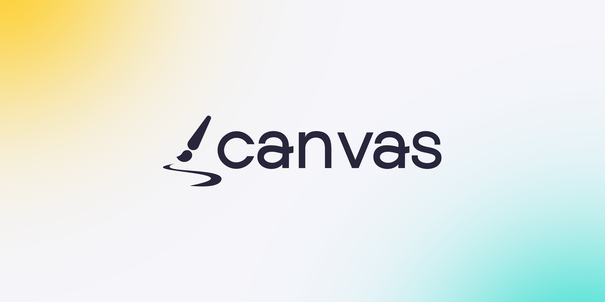
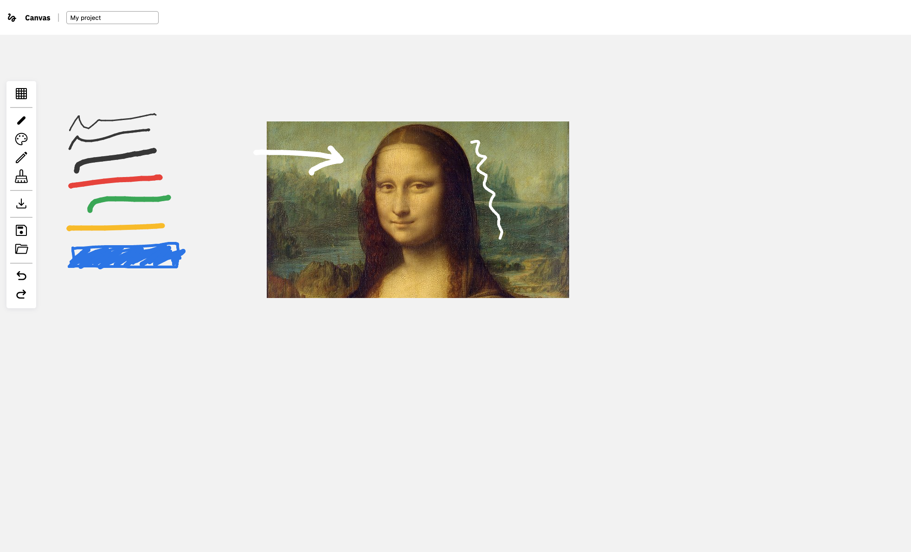

# Canvas

> Canvas is a real-time collaboration platform that allows users to draw, write, and collaborate together in a shared digital space.

### [Live demo here](https://canvas.espiec.com) (In construction)

## Screenshot



## To do

- [ ] Clean the code
- [ ] Open project : check format and info
- [ ] Move image in canvas
- [ ] Zoom in workspace
- [ ] Infinite workspace
- [ ] Pen brushes (IE Photoshop)

## Technologies

- Next.js
- TypeScript
- Zustand
- Chakra UI
- React Query
- Recoil
- Framer Motion
- Socket.io

## Running

``````cmd
pnpm install		# Install dependencies for the project
pnpm run server		# Run the server
pnpm run dev		# Run the client
``````
